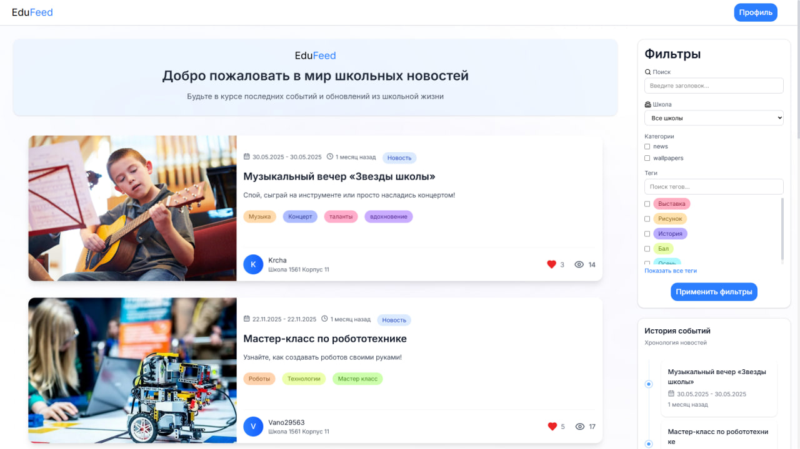
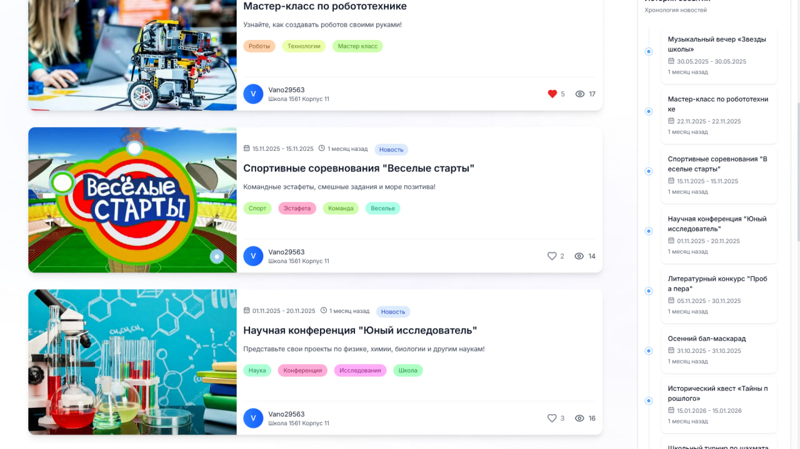
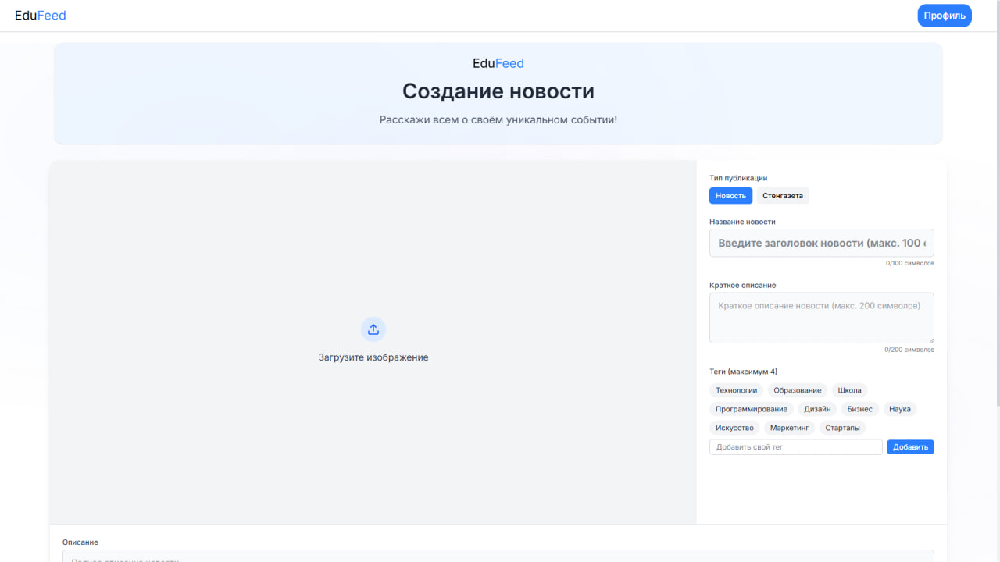
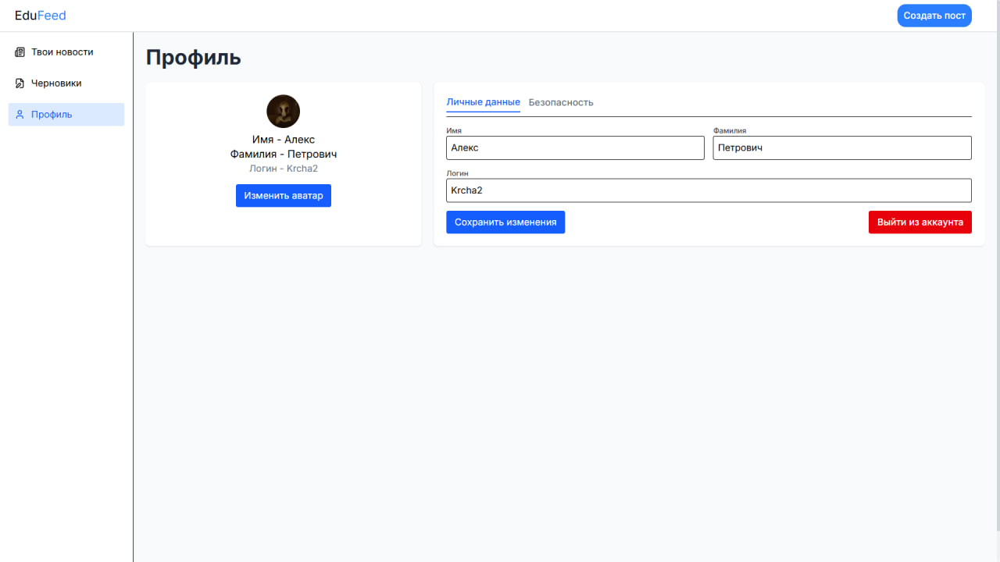

# 📚 EduFeed — Современная платформа школьных новостей

<div align="center">


</div>

## Сайт - https://edufeed.ru/

## 📖 О проекте

**EduFeed** — это современная новостная платформа, специально разработанная для школ и образовательных учреждений. Наша цель — создать безопасное и удобное пространство для обмена информацией между всеми участниками образовательного процесса.

### 🌟 Ключевые преимущества

- 🎯 **Простой и интуитивный интерфейс** — легкость использования для всех возрастных групп
- 🔒 **Безопасность** — строгая модерация контента и защита персональных данных
- 📱 **Адаптивный дизайн** — удобный просмотр с любых устройств
- 🚀 **Высокая производительность** — быстрая загрузка и отклик системы



## 🎯 Основной функционал

### Для учеников
- 📰 Просмотр актуальных новостей и событий
- 🎨 Создание собственных публикаций
- ❤️ Взаимодействие с контентом
- 👤 Личный профиль

### Для учителей и администрации
- ✍️ Публикация официальных объявлений
- 🛡️ Модерация контента
- 📊 Статистика и аналитика(в разработке)
## 🛠️ Стек технологий

### Frontend:

- **Vue 3 + Composition API** — быстрый, реактивный интерфейс.
- **Tailwind CSS** — адаптивная и кастомизируемая стилизация.
- **Vite** — сверхбыстрая сборка и HMR.

### Backend:

- **Python + Flask** — лёгкий и мощный REST API.
- **PostgreSQL** — надёжная СУБД для хранения пользователей и постов.
- **Tavern** — API-тестирование (покрытие основных endpoint'ов).
- **Docker** — изолированная среда, быстрое развертывание.

## 🚀 Установка и запуск

### Быстрый старт с Docker

1. **Клонирование репозитория**
   ```bash
   git clone https://github.com/yourusername/edufeed.git
   cd edufeed
   ```

2. **Настройка окружения**
   ```bash
   cd backend
   cp .env.example .env
   # Отредактируйте .env файл под свои нужды
   cd ..
   cd frontend
   cp .env.example .env
   # Отредактируйте .env файл под свои нужды
   cd ..
   ```

3. **Запуск**
   ```bash
   cd backend
   docker-compose up -d --build
   cd ..
   cd frontend
   npm install
   npm run dev
   ```

## 🧑‍💻 Команда

| Участник | Роль                 |
|----------|----------------------|
| Krcha    | Frontend-разработка  |
| arttyu    | Backend и Тестировка |

## 📸 Галерея

<div align="center">

### 📱 Мобильный вид


### 💻 Десктопный вид
| 📥 Лента новостей           | ✍️ Создание поста             | 🙎‍♂️ Профиль пользователя     |
|-----------------------------|-------------------------------|--------------------------------|
|  |  |  |

</div>

## 📄 Лицензия

Проект распространяется под лицензией MIT. Подробнее см. [LICENSE](./LICENSE).

---

<div align="center">

### 🌟 Спасибо за использование EduFeed! 🌟

</div>